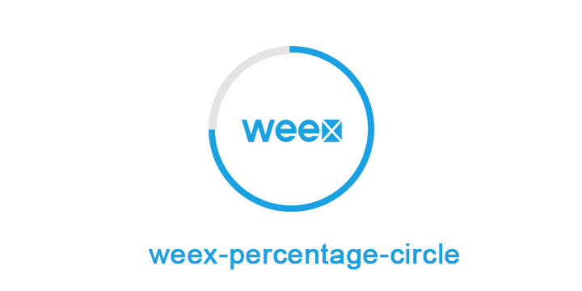
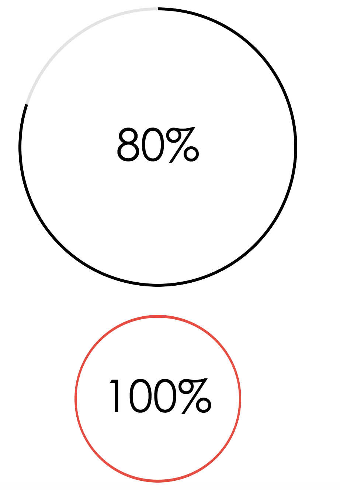

# weex-percentage-circle

weex-percentage-circle is a component which supports you define your percent and draw the circle.And also you can use it as a progress bar.

 

shots:



### Start 

``` bash
npm i weex-percentage-circle --save

```

``` js

<template>
  <div class="container">
    <div class="item">
        <weex-percentage-circle border-width="2" color="#e74c3c" percent="100" radius="60"></weex-percentage-circle> 
     </div>
     
  </div>
</template>

<style>
  .container{
    display: flex;
    flex-direction: column;
    align-self: center;
    align-items: center;
  }
  
</style>

<script>
  require('../../src/weex-percentage-circle.we')

</script>

```

### Options

| Props        | Type         | Example  | Description  |
| ------------- |:-------------:| -----:|----------:|
| color     | string | '#000' | the color of border |
| percent      | Number      |  30 | the percent you need |
| radius | Number     |    20 | how large the circle is |
| border-width | Number(default 2)     |    5 | the width of  percentage progress bar |
### Contributions

Your contributions and suggestions are welcome 😄😄😄

[React-Native-Percentage-Circle](https://github.com/JackPu/react-native-percentage-circle)

### MIT License


